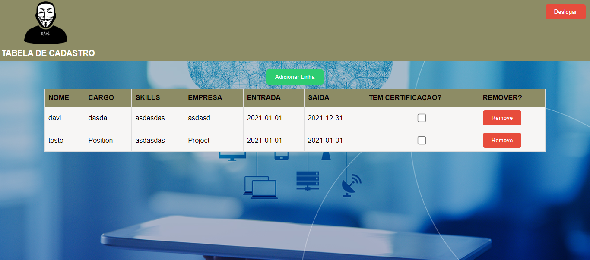

<div style="display:flex; align-items:center;">
  <h1 style="margin-right: 20px;">LoginTable!</h1>
  
</div>


<h2>Descrição</h2>

Este projeto é uma aplicação web que permite aos usuários adicionar itens em uma tabela, utilizando HTML, CSS e JavaScript. Além disso, a utilização do Storage do navegador é utilizada para salvar os itens na tabela, permitindo que eles persistam mesmo após o fechamento do navegador.

<h2>Funcionalidades</h2>

A aplicação possui as seguintes funcionalidades:

- Tela de login: onde o usuário pode fazer login na aplicação;
- Tela principal: onde o usuário pode adicionar itens à tabela e visualizar os itens que já foram adicionados;
- Armazenamento local: os itens adicionados na tabela são armazenados no storage do navegador, permitindo que sejam recuperados mesmo após o fechamento da aplicação.

<h2>Tecnologias Utilizadas</h2>

As seguintes tecnologias foram utilizadas para o desenvolvimento deste projeto:

-  HTML
-  CSS
-  JavaScript

<h2>Padrão de Projeto</h2>

O padrão de projeto utilizado no projeto é o MVC (Model-View-Controller). O padrão MVC divide a aplicação em três componentes principais: o Model, que contém a lógica de negócios e os dados da aplicação, a View, que exibe as informações para o usuário, e o Controller, que atua como intermediário entre o Model e a View e gerencia as interações do usuário.

No contexto do projeto, podemos aplicar o padrão MVC da seguinte forma:

- Model: O arquivo employees.js contém a lógica de negócios e os dados da tabela, incluindo as funções para adicionar e remover linhas, e salvar e restaurar dados na memória local.
- View: Os arquivos index.html e employees.html contêm a interface do usuário que exibe os dados da tabela e o formulário de login.
- Controller: O arquivo employees.js atua como o controlador, gerenciando as interações do usuário e fazendo a interface entre a View e o Model. Ele é responsável por adicionar e remover linhas da tabela, salvar e restaurar dados na memória local e lidar com as interações do usuário.

Com o padrão MVC, o código fica mais organizado e fácil de manter, além de facilitar a adição de novas funcionalidades no futuro.

<h2>Executando o projeto</h2>

Para executar o projeto, basta abrir o arquivo index.html no seu navegador. A partir daí, você será direcionado para a tela de login, onde poderá fazer login na aplicação. Após fazer login, você será redirecionado para a tela principal, onde poderá adicionar itens à tabela e visualizar os itens que já foram adicionados.

<h2>Para utilizar o projeto local, mega simples, siga os seguintes passos:</h2>

Faça o download ou clone o repositório do projeto para o seu computador.
Abra o arquivo index.html em um navegador de sua escolha.
Será exibida a tela de login. Você pode fazer login usando as credenciais de teste fornecidas ou criar sua própria conta.
Após fazer login, você será redirecionado para a tela principal, onde poderá adicionar itens à tabela e visualizar os itens que já foram adicionados.
Para adicionar um item à tabela, preencha o formulário na parte superior da tela e clique no botão "Adicionar".
Para remover um item da tabela, clique no botão "Remover" na linha correspondente ao item que deseja excluir.
Os itens adicionados na tabela serão salvos na memória local do navegador e persistirão mesmo após o fechamento do navegador.
Abaixo estão as imagens de ilustração do projeto:

<h2>para logar, usuário admin@admin senha: admin</h2>




<h2>Uso com Dockerfile</h2>

Certifique-se de que o arquivo Dockerfile esteja na raiz do seu projeto.

bash

Copy code
# Imagem base
FROM node:latest

# Diretório de trabalho
WORKDIR /app

# Copia os arquivos do projeto para o diretório de trabalho
COPY . .

# Instala as dependências
RUN npm install

# Expõe a porta da aplicação
EXPOSE 3000

# Comando para iniciar a aplicação
CMD ["npm", "start"]

## Como usar o Dockerfile

Para executar o aplicativo em um contêiner Docker, siga as instruções abaixo:

1. Certifique-se de ter o Docker instalado em seu computador.

2. Na raiz do projeto, execute o seguinte comando para construir a imagem Docker:

docker build -t login-table .

3. Em seguida, execute o seguinte comando para iniciar o contêiner:

docker run -p 8080:80 login-table

4. Abra o navegador e acesse http://localhost:8080 para visualizar o aplicativo.

Observação: O aplicativo requer uma conexão com a internet para carregar as bibliotecas JavaScript do Bootstrap e do jQuery.```

Certifique-se de adaptar as instruções ao seu próprio projeto, fornecendo detalhes relevantes para que outras pessoas possam construir e executar o aplicativo em um contêiner Docker.

<h2>Contribuindo</h2>
Este projeto está aberto a contribuições da comunidade. Caso queira contribuir, basta fazer um fork do repositório, fazer as suas alterações e enviar um pull request. Faremos a revisão das suas alterações e, se estiverem de acordo com as diretrizes do projeto, elas serão incorporadas ao código principal.
Também agradecemos a contribuição de patrocinadores, que podem entrar em contato via email devops.davi@gmail.com para colaborar com o projeto, seja com pequenas doações para obter o projeto com mais recursos e funcionalidades ou para desenvolvimento personalizado para empresas e clientes. Agradecemos antecipadamente a todos que se interessam em ajudar a melhorar este projeto.

<h2>Licença</h2>
Este projeto está licenciado sob a licença MIT. Veja o arquivo LICENSE para mais detalhes.
<h2>Autor</h2>
Desenvolvido por Davi, 2023.
<h2>Ícones das tecnologias utilizadas</h2>
Abaixo estão os ícones das tecnologias utilizadas neste projeto:
HTML 
CSS 
JavaScript 
<h2>Foto do autor</h2>
<p>Davi DevOps:</p>

